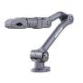
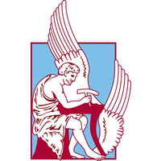
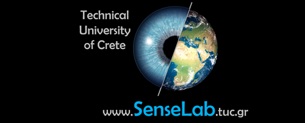

# Z1 Hand-Teleop Station

Gazebo simulation of the Unitree Z1 robotic arm that **follows the operator's
hand** seen by a camera (MediaPipe Hands), containerized in Docker.




---

## Table of Contents

- [Overview](#overview)
- [Operator conventions](#operator-conventions)
- [Architecture](#architecture)
- [Install and build](#install-and-build)
- [Quick start](#quick-start)
- [Camera sourcing — Windows reality check](#camera-sourcing--windows-reality-check)
- [Configuration](#configuration)
- [ROS topics](#ros-topics)
- [Shell aliases](#shell-aliases)
- [Troubleshooting](#troubleshooting)
- [AI-assistance](#ai-assistance)

---

## Overview

The Z1 (in Gazebo) mirrors the participant's hand: move your hand, the arm
copies it. A camera frame goes to a MediaPipe **Hands** node, which maps the
tracked hand point's position in the image directly to a world-frame target; the
arm-tracker node solves IK and drives the Gazebo joint controllers.

This is a hand-teleop fork of an ArUco-marker tracking station — the ArUco
perception was removed and replaced by hand/arm following. The control side is
reused almost verbatim: a hand mirror *is* a 2D target.

**Default control law — Cartesian "hand mirror" (no calibration, no TF, no
depth):**

```
u, v = normalized image coords of the tracked hand point  (v grows downward)
Y =  map(u, 0..1 -> y_max..y_min)   # mirrored: hand right -> arm right
Z =  map(v, 0..1 -> z_max..z_min)   # inverted: image v is top-down
X =  fixed_x                        # depth held constant
```

The image uses Mesa software rendering (llvmpipe) by default — no GPU is required
to run Gazebo or RViz, and MediaPipe Hands runs fine on CPU.

---

## Operator conventions

> **Cheat sheet: Open palm to drive, fist to freeze. Show your right hand.**

1. **Handedness.** One hand is tracked (`gesture/hand`, default `right`). The
   feed is mirrored (selfie view) so "right" means *your* right hand.
2. **Clutch.** The arm follows **only while engaged**:
   - **Open palm** (≥4 fingers extended) → **ENGAGE** (arm follows).
   - **Closed fist** (≤1 finger extended) → **FREEZE** (arm holds its pose).
     Lets you reposition your hand without dragging the arm.
   - A short frame hysteresis avoids flicker.
3. **Start frozen (safety).** The arm always starts frozen on launch and after
   the hand is lost — show an open palm to (re)engage. It never lurches on start.
4. **Gripper.** Pinch (thumb-to-index distance) drives the gripper: fingers
   together = closed, apart = open (`gesture/gripper: pinch`, default on).
5. **Lost hand.** If the hand disappears for `gesture/lost_frames` frames, the
   arm freezes and the clutch resets.

The `/hand/debug_image` overlay shows the landmarks, the detected hand, the
finger count, the clutch state (ENGAGED/FROZEN), the target Y/Z, and the gripper
value, with a green border while driving and red while frozen.

---

## Architecture

```
 Real camera (webcam / ZED-2 UVC / D435 / video file)
        |  /camera/color/image_raw          (sensor_msgs/Image)
        v
 hand_detector_node  --> /hand/target_pose      (geometry_msgs/PoseStamped, world)
   (MediaPipe Hands) --> /hand/tracking_active   (std_msgs/Bool)  clutch + detection gate
                     --> /hand/debug_image       (sensor_msgs/Image, overlay)
                     --> /hand/gripper_cmd        (std_msgs/Float64, pinch 0..1)
        |
        v
 arm_tracker_node  --> /z1_gazebo/JointXX_controller/command  (MotorCmd x6)
                   --> /z1_gazebo/gripper_controller/command   (MotorCmd)
        ^
 Gazebo: Z1 arm + joint controllers + robot_state_publisher (TF)
```

The image source is swappable (Gazebo plugin / webcam / D435 / ZED-2 UVC / video
file) because every consumer only knows the `/camera/color/image_raw` topic.

**Packages**

| Package | Role | Key files |
| --- | --- | --- |
| `z1_hand_detector` | Perception | `hand_detector_node.py`, `image_source_node.py`, `zed_camera_node.py` |
| `z1_arm_tracker` | Control | `arm_tracker_node.py` |
| `z1_teleop` | Launch / world / xacro / rviz / config | `launch/*.launch`, `worlds/teleop.world`, `xacro/z1_teleop_robot.xacro`, `rviz/z1_teleop.rviz`, `config/teleop.yaml` |
| `sdk_z1` (submodule) | Z1 SDK (C++) — IK model | upstream `unitreerobotics/z1_sdk` |
| `z1_controller` (submodule) | Gazebo `sim_ctrl` bridge | upstream `unitreerobotics/z1_controller` |
| `unitree_ros` (submodule) | URDF / descriptions / `unitree_legged_msgs` | upstream `unitreerobotics/unitree_ros` |

---

## Install and build

### Prerequisites
- Docker (Docker Desktop on Windows/macOS).
- An X server for the GUI: VcXsrv on Windows (`-wgl`), XQuartz on macOS, native X
  on Linux.
- For the ZED/D435 real-camera paths on Windows: `usbipd-win`.

### Build the image

```bash
git clone --recursive https://github.com/billisandr/ros_z1_teleop.git
cd ros_z1_teleop
docker build -t ros-z1-teleop .
```

If you cloned without `--recursive`:

```bash
git submodule update --init --recursive
```

The first build takes ~10–15 min (it compiles the Z1 SDK and the `z1_controller`
Gazebo bridge, then `catkin_make`). The build runs an import smoke test that
fails loudly if MediaPipe / OpenCV / `cv_bridge` do not coexist.

---

## Quick start

See [docs/QUICKSTART.md](docs/QUICKSTART.md) for the full walkthrough and
[docs/MINIMAL_QUICKSTART.md](docs/MINIMAL_QUICKSTART.md) for commands only.

### A. Hardware-free demo (looping video file)

Start the X server, then:

```bash
docker run -it --rm --name ros-z1-teleop -e DISPLAY=host.docker.internal:0.0 \
    ros-z1-teleop bash -ic "z1_teleop image_source:=video:/path/to/hand.mp4"
```

In another terminal, release physics and open RViz:

```bash
docker exec -it ros-z1-teleop bash -ic "z1_unpause"
docker exec -it -e DISPLAY=host.docker.internal:0.0 ros-z1-teleop bash -ic "z1_rviz"
```

### B. Local webcam (Linux/macOS hosts)

Pass the camera device into the container and use the default `webcam` source:

```bash
docker run -it --rm --name ros-z1-teleop --device /dev/video0:/dev/video0 \
    -e DISPLAY=$DISPLAY ros-z1-teleop bash -ic "z1_teleop"
```

(On Windows the built-in webcam generally cannot be passed into Docker — use a
video file or the ZED path. See the camera section below.)

### C. ZED 2 over USB (recommended on Windows)

One-shot script (from **Git Bash on the Windows host**) — handles VcXsrv,
`usbipd` bind/attach, `uvcvideo`, container start, and auto-opens RViz:

```bash
bash start_teleop.sh                 # launches z1_teleop_zed
```

Then release physics:

```bash
docker exec -it ros-z1-teleop bash -ic "z1_unpause"
```

---

## Camera sourcing — Windows reality check

The operator's camera is the practical crux on Windows:

- **Laptop integrated webcams generally cannot be `usbipd`-attached** into the
  Docker Desktop WSL2 VM. Don't assume `/dev/video0` is the built-in webcam
  inside the container.
- **Recommended paths, in order:**
  1. **Bundled/looping video file** (`image_source:=video:/path.mp4`) — zero
     hardware, always works, great for first bring-up and attendees without
     cameras.
  2. **ZED 2 / external USB cam via `usbipd`** — `start_teleop.sh` does the
     bind/attach/`uvcvideo` dance; use the lowest-bandwidth UVC mode
     (`1344x376@15fps` is corruption-free — see
     [docs/DOCKER_CMDS.md](docs/DOCKER_CMDS.md)).
  3. **Run MediaPipe on the host**, publish over the ROS network, and point
     `ROS_MASTER_URI` at the container (advanced).
- **Linux/macOS:** native `--device /dev/video0` works for a built-in or USB
  webcam.

---

## Configuration

All knobs live in [z1_teleop/config/teleop.yaml](z1_teleop/config/teleop.yaml),
loaded at launch. Highlights:

| Block | Key | Meaning |
| --- | --- | --- |
| `control` | `mode` | `cartesian` (default) or `joint_mirror` (stretch, not wired) |
| `hand` | `image_source` | `webcam` / `video:/path.mp4` / `external` |
| `hand` | `flip_horizontal` | selfie view so handedness matches the operator |
| `mapping` | `tracked_point` | `wrist` or `palm_centroid` |
| `mapping` | `fixed_x`, `y_range`, `z_range` | image→world map (mirror/invert) |
| `gesture` | `hand` | `right` / `left` / `either` |
| `gesture` | `clutch` | `palm_fist` / `always_on` / `pinch_hold` |
| `gesture` | `gripper` | `pinch` / `none` |
| `gesture` | `lost_frames`, `hysteresis_frames` | freeze / flicker control |
| `smoothing` | `min_cutoff`, `beta` | OneEuro filter on (u,v) |
| `arm_tracker` | `workspace`, `smoothing_alpha`, `enable_gripper` | control limits + gripper |

Edit the YAML and relaunch (or `docker cp` it into a running container) — no
rebuild needed.

---

## ROS topics

| Topic | Type | Description |
| --- | --- | --- |
| `/camera/color/image_raw` | `sensor_msgs/Image` | Camera feed (any source) |
| `/hand/target_pose` | `geometry_msgs/PoseStamped` | World-frame target (X fixed) |
| `/hand/tracking_active` | `std_msgs/Bool` | True only when hand present + engaged |
| `/hand/debug_image` | `sensor_msgs/Image` | Landmark + HUD overlay |
| `/hand/gripper_cmd` | `std_msgs/Float64` | Pinch → gripper, 0 (closed) .. 1 (open) |
| `/z1_gazebo/JointXX_controller/command` | `unitree_legged_msgs/MotorCmd` | Per-joint command |
| `/z1_gazebo/gripper_controller/command` | `unitree_legged_msgs/MotorCmd` | Gripper command |

---

## Shell aliases

Available inside the container (defined in `~/.bashrc`):

| Alias | Action |
| --- | --- |
| `z1_teleop` | Launch the station (webcam/video sim) |
| `z1_teleop_zed` | Launch with the ZED 2 bridge |
| `z1_unpause` | Release Gazebo physics |
| `z1_rviz` | Open the preconfigured RViz |
| `z1_hand` | Run the hand detector alone |
| `z1_tracker` | Run the arm tracker alone |
| `z1_cam` | View `/hand/debug_image` |
| `z1_target` / `z1_active` / `z1_gripper` | Echo the hand topics |
| `z1_joints` | Echo `/z1_gazebo/joint_states` |

---

## Troubleshooting

| Symptom | Fix |
| --- | --- |
| Gazebo/RViz window never appears | X server not running with `-wgl` (Windows) / `DISPLAY` not set |
| Arm doesn't move | Show an **open palm** to engage; check `/hand/tracking_active` is true and physics is unpaused (`z1_unpause`) |
| Wrong hand tracked | Set `gesture/hand`; confirm `hand/flip_horizontal: true` |
| No hand detected | Improve lighting; lower `hand/min_detection_confidence`; check `/hand/debug_image` |
| Garbled ZED video over usbipd | Use the `1344x376@15fps` mode; see [docs/DOCKER_CMDS.md](docs/DOCKER_CMDS.md) |
| `mediapipe`/`cv2` import error | Rebuild the image — the in-build smoke test must pass |

---

## AI-assistance

Parts of this workspace were developed with the assistance of large language
models (Claude by Anthropic).

AI-generated code here controls a **simulated** robotic arm. Before adapting any
of it to real hardware:

- Review the workspace bounds and gains in
  [z1_teleop/config/teleop.yaml](z1_teleop/config/teleop.yaml).
- Test incrementally at low speeds before enabling full tracking.
- This code is for simulation and educational use — use caution on real hardware.

---

<sub>Technical University of Crete · SenseLab</sub>

 
